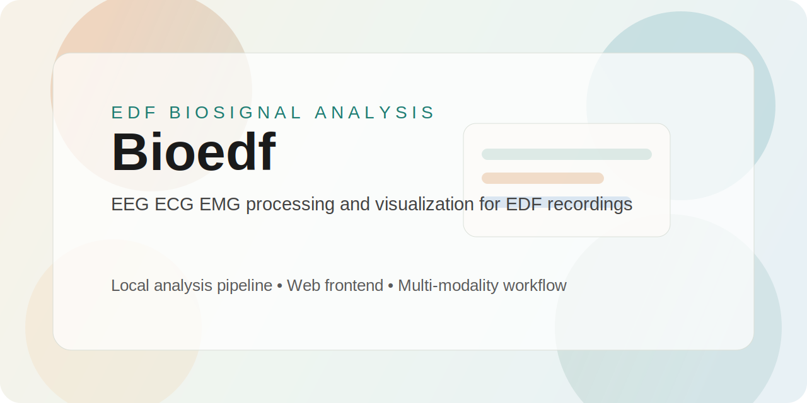

<p align="center">
  
</p>

<p align="center">
  <strong>中文</strong>
  ·
  <a href="README_EN.md">English</a>
  ·
  <a href="README.md">Home</a>
</p>

# Bioedf

Bioedf 是一个面向 EEG、ECG、EMG 的本地 EDF 生理信号分析项目，支持命令行分析与本地前端页面操作。系统会自动识别信号模态，应用对应的预处理参数，并生成分析结果图，适合样例验证、算法演示和团队交接使用。

## Quick Start

### 1. 下载代码

```bash
git clone git@github.com:Dongkun-Wang/Bioedf.git Bioedf
cd Bioedf
```

### 2. 安装 `uv`

如果还没有安装 `uv`：

```bash
curl -LsSf https://astral.sh/uv/install.sh | sh
```

检查是否安装成功：

```bash
uv --version
```

### 3. 创建环境并安装依赖

```bash
uv venv
uv sync
```

### 4. 启动前端

```bash
.venv/bin/python frontend_server.py
```

浏览器打开：

[http://127.0.0.1:8765](http://127.0.0.1:8765)

### 5. 前端使用流程

1. 填写姓名、性别、年龄等基本信息。
2. 选择脑电、心电或肌电模态。
3. 上传一个 EDF 文件。
4. 保持默认分析模块全开，或手动关闭不需要的模块。
5. 点击开始分析，查看摘要与结果图。

### 6. 输入规则

- 脑电 EEG：上传 1 个包含 5 通道的 EDF，系统会先做五通道平均后再分析。
- 心电 ECG：上传 1 个 EDF；如果是多通道，默认分析第 3 通道。
- 肌电 EMG：上传 1 个 EDF，直接分析可用通道。

### 7. 如果没有 `uv`

```bash
python3 -m venv .venv
. .venv/bin/activate
python -m ensurepip --upgrade
python -m pip install numpy scipy matplotlib pandas pytest pyedflib
python frontend_server.py
```

## 项目亮点

- 一个项目同时覆盖 EEG、ECG、EMG 三类生理信号。
- 针对 EDF 数据进行了读取、通道选择和分析流程适配。
- 提供本地前端，可直接完成上传、模块开关、结果浏览。
- 支持分段分析、时窗裁剪、图片导出。
- 已按 EDF 规则改写脑电与心电的多通道处理逻辑。

## 数据规则

加载器支持以下输入方式：

- 直接输入单个 EDF 文件
- 输入一个模态目录，例如 `data_example/脑电`
- 输入包含 `EP`、`EPFilter`、`EVENT` 子目录的数据目录

当同时存在多个子目录时，优先使用 `EP`，其次使用 `EPFilter`，忽略 `EVENT`。

通道规则：

- EEG：一个 EDF 内有五个通道，分析前平均成单通道 `eeg_mean`
- ECG：如果 EDF 是多通道，默认读取第 3 通道
- EMG：直接使用可用通道

## 常用命令

分析单个 EDF 文件：

```bash
.venv/bin/python main.py --input /path/to/your_signal.edf --no-display --save-figures
```

启动前端：

```bash
.venv/bin/python frontend_server.py
```

运行测试：

```bash
.venv/bin/python -m pytest -q
```

## 时间窗口裁剪

如果只想分析记录中的一小段时间，可以这样运行：

```bash
.venv/bin/python main.py \
  --input ./data_example/脑电 \
  --slice-start "13:48:12" \
  --slice-end "13:48:20" \
  --no-display \
  --save-figures
```

支持两种格式：

- 仅时间：`"17:17:10"`
- 完整日期时间：`"2024-06-26 17:17:10"`

## 默认分析设置

默认带通范围：

- EEG：`0.4-60 Hz`
- ECG：`5-25 Hz`
- EMG：`20-250 Hz`

默认模块映射：

- EEG：`BandAnalysis`
- ECG：`Heartrate`
- EMG：`FFT`、`STFT`、`FreqAnalysis`

重要行为：

- EEG 会先被压缩为一个平均分析通道。
- ECG 多通道时默认取第 3 通道。
- 模态识别默认自动完成。

## 主要模块

- `utils/LoadDataset.py`：EDF 查找、模态识别、通道选择、分段
- `utils/Preprocess.py`：带通、带阻滤波
- `utils/BandAnalysis.py`：脑电频带功率及指标分析
- `utils/Heartrate.py`：心电心率与 HRV 分析
- `utils/FFT.py`：肌电 FFT 频谱分析
- `utils/STFT.py`：肌电时频分析
- `utils/FreqAnalysis.py`：肌电 RMS、MPF、MDF 趋势分析
- `frontend_server.py`：本地接口与结果图片服务

## 项目结构

```text
Bioedf/
├── data_example/         # EDF 样例数据
├── tests/                # 回归测试
├── utils/                # 数据加载、预处理与分析模块
├── webui/                # 前端静态资源
├── frontend_server.py    # 本地前端服务
├── main.py               # 命令行入口
├── nm_config.py          # 默认配置
└── pyproject.toml        # 项目依赖
```

## 输出结果

生成的图片默认会保存到：

```text
result/
└── <MODALITY>/
    └── <module>/
```

常用运行配置见 [`nm_config.py`](/Users/teddy/Desktop/Bioedf/nm_config.py)：

- `dataset`：输入发现、裁剪、分段
- `preprocess`：滤波开关、范围、阶数
- `analysis`：各分析模块参数
- `display`：交互显示开关
- `output`：导出格式与分辨率

## 说明

- 推荐 Python `3.12`。
- `uv sync` 会根据 `pyproject.toml` 和 `uv.lock` 安装依赖。
- 前端页面完全本地运行。
- `data/`、`docs/`、`result/` 默认不纳入 git。
- 如果需要保持历史结果可复现，不建议随意修改 EEG 平均规则和 ECG 峰值检测逻辑。
